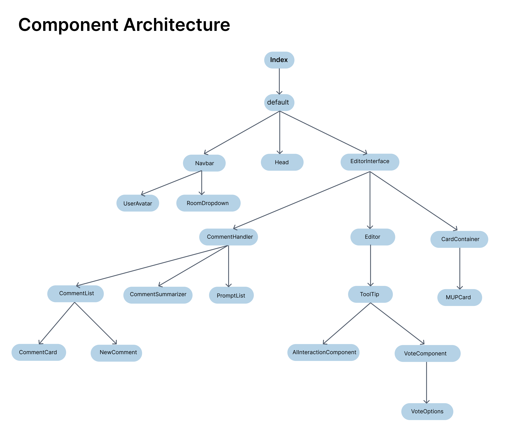

# Collab App

A collaborative web app built with Next.js and PartyKit.

---

## Technologies Used

- [Next.js 14](https://nextjs.org/docs/getting-started)
- [NextUI](https://nextui.org)
- [Tailwind CSS](https://tailwindcss.com)
- [Tailwind Variants](https://tailwind-variants.org)
- [TypeScript](https://www.typescriptlang.org)
- [Framer Motion](https://www.framer.com/motion)
- [next-themes](https://github.com/pacocoursey/next-themes)
- [PartyKit](https://partykit.io)
- [Ollama](https://ollama.com)

---

## Run with Docker

```bash
cp .env.example .env
docker pull msamy12/colab-app:ready
docker run --env-file .env -p 3000:3000 -p 1999:1999 msamy12/colab-app:ready
```

---

## Component Tree



---

## How to Use (Development)

### 1. Clone and Setup

```bash
git clone <repo-url>
cd <repo-folder>
```

### 2. Install Ollama

Download and install from [https://ollama.com](https://ollama.com)

---

## Development Setup

### 1. Install dependencies

```bash
npm install --legacy-peer-deps
```

### 2. Install extra dependencies for comment icons

```bash
npm install @mui/material @emotion/react @emotion/styled @mui/icons-material
```

### 3. Configure environment

```bash
cp .env.example .env
```

### 4. Run development server (Next.js + PartyKit)

```bash
npm run dev
```

### 5. Run PartyKit only (optional)

```bash
npx partykit dev
```

### 6. Run Next.js only (optional)

```bash
npm run dev1
```

### 7. Preload AI model (optional)

```bash
ollama run llama3
```

---

## Production Build & Deployment

### 1. Create a production build

```bash
npm run build
```

### 2. Start the built app

```bash
npm start
npx partykit dev
```

---

## License

Licensed under the [MIT license](https://github.com/nextui-org/next-pages-template/blob/main/LICENSE)

---

## Contributors

- Omar Alabed Alsalh
- Shahrzad Azimi
- Mohamed Elnemr
- Matin Goodarzi
- Daniel Hadirahardjo
- Paula Hummel
- Ghofrane Kamoun
- Wafi Kamoun
- Pascal Lange
- Leon Lehner
- Felix Plenk
- Samuel Richter
